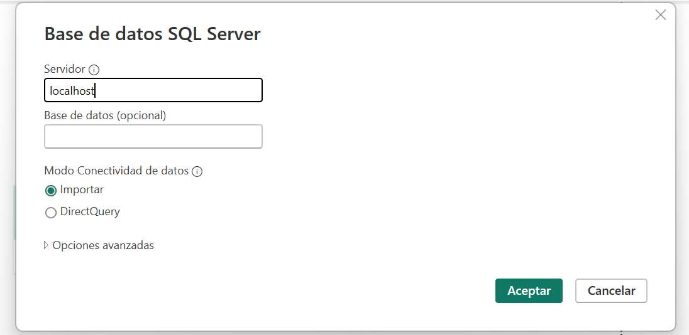

<h1>Hola , soy David!! </h1>

 En este repo te muestro como he desarrollado un almacen de datos a partir de la base de datos
AdventureWorks de microsoft, la cual consta de una tienda ficticia de ventad e bicicletas a nivel
internacional. 

Para esto es importante tener instalado SQL Sever y la base de datos antes mencionada.

