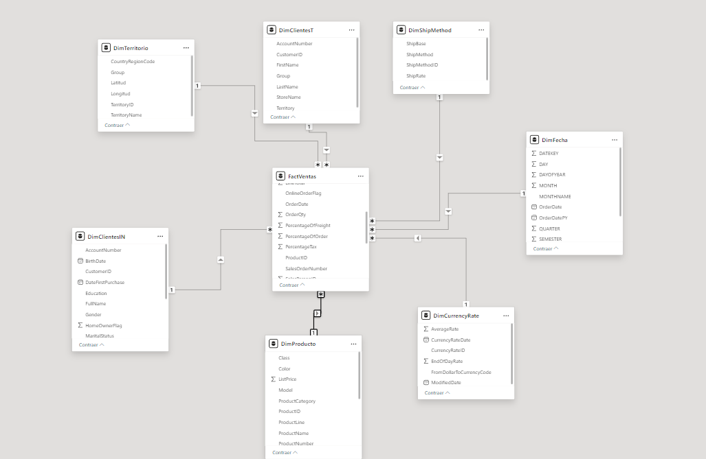

<h1>DataWarehouse con SQL server</h1>

 En este repo se ilustra el desarrollado un almacen de datos a partir de la base de datos
AdventureWorks de microsoft, la cual consta de una tienda ficticia de venta de bicicletas a nivel
internacional. 

Para esto es importante conocer las herramientas necesarias:
## Herramientas y Tecnologías 
- SQL Server
- AdventureWorks Database
- SQL

## Estructura del Proyecto
  - `ETL_AdventureWorks.sql`: Contenido de los scripts para el ETL.

A continuación se muestra el modelo estrella como resultado de la transformación

 
Como se puede observar , nuestra tabla de hechos es nuestra tabla de ventas. En ella se han combinado las tablas
Sales <b>Sales.SalesOrderHeader</b> y <b>Sales.SalesOrderDetail</b>, que son las que contienen la información 
de las facturas a los clientes. En esta se agregan los campos de interés y se realizan las transformaciones 
pertinentes para una interpretación más eficiente y rápida.
También se puede visualizar las dimensiones que son : Los clientes individuos , clientes tiendas, territorios de ventas,
métodos de envío, fecha, tipo de moneda y producto.
